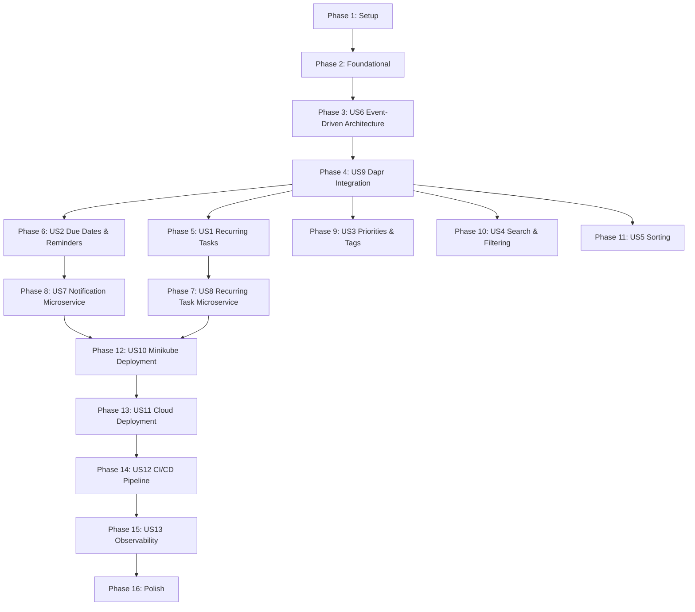

# Tasks: Phase 5 - Event-Driven Cloud Deployment

**Input**: Design documents from `/specs/005-event-driven-cloud/`
**Prerequisites**: plan.md (✅), spec.md (✅), research.md (✅), data-model.md (✅), contracts/ (✅)

**Tests**: TDD approach required per constitution - tests included for all user stories

**Organization**: Tasks grouped by user story to enable independent implementation and testing

## Format: `[ID] [P?] [Story] Description`

- **[P]**: Can run in parallel (different files, no dependencies)
- **[Story]**: User story identifier (US1-US13)
- Include exact file paths in descriptions

## Path Conventions

This is a web application with microservices:
- Backend: `todo_app/phase_5/backend/src/`
- Microservices: `todo_app/phase_5/services/{service-name}/src/`
- Frontend: `todo_app/phase_5/frontend/src/`
- Kubernetes: `todo_app/phase_5/k8s/`

---

## Phase 1: Setup (Shared Infrastructure)

**Purpose**: Project initialization and Phase 5 structure

- [ ] T001 Create Phase 5 directory structure (backend/, services/, frontend/, k8s/)
- [ ] T002 Copy Phase 3 backend to Phase 5 and update dependencies (FastAPI 0.115+, Dapr SDK 1.14+)
- [ ] T003 [P] Copy Phase 3 frontend to Phase 5 and update dependencies (Next.js 15+, React 19+)
- [ ] T004 [P] Initialize notification-service project with Python 3.13+ and uv
- [ ] T005 [P] Initialize recurring-task-service project with Python 3.13+ and uv
- [ ] T006 [P] Configure pytest 8.3+ for all Python projects
- [ ] T007 [P] Configure testcontainers-python 4.9+ for integration tests
- [ ] T008 Create .env.example files for all services with required environment variables

---

## Phase 2: Foundational (Blocking Prerequisites)

**Purpose**: Core infrastructure that MUST be complete before ANY user story implementation

**⚠️ CRITICAL**: No user story work can begin until this phase is complete

### Database Migrations

- [ ] T009 Create Alembic migration: Add priority, tags, due_at, recurrence_id to tasks table
- [ ] T010 [P] Create Alembic migration: Create task_recurrences table
- [ ] T011 [P] Create Alembic migration: Create task_reminders table
- [ ] T012 [P] Create Alembic migration: Create notifications table
- [ ] T013 Create composite indexes on tasks table (user_id+due_at, user_id+priority)

### Extended Domain Models

- [ ] T014 Update Task model in todo_app/phase_5/backend/src/models/task.py (add priority, tags, due_at, recurrence_id)
- [ ] T015 [P] Create TaskRecurrence model in todo_app/phase_5/backend/src/models/task_recurrence.py
- [ ] T016 [P] Create TaskReminder model in todo_app/phase_5/backend/src/models/task_reminder.py
- [ ] T017 [P] Create Notification model in todo_app/phase_5/backend/src/models/notification.py
- [ ] T018 [P] Create Priority enum in todo_app/phase_5/backend/src/models/enums.py
- [ ] T019 [P] Create RecurrencePattern enum in todo_app/phase_5/backend/src/models/enums.py
- [ ] T020 [P] Create NotificationChannel enum in todo_app/phase_5/backend/src/models/enums.py
- [ ] T021 [P] Create NotificationStatus enum in todo_app/phase_5/backend/src/models/enums.py

### Kafka Setup (Local Development)

- [ ] T022 Create docker-compose.yml for local Kafka (Bitnami Kafka in KRaft mode)
- [ ] T023 Configure Kafka topics in docker-compose: task-events (3 partitions), reminders (2 partitions), notifications (2 partitions)

### Dapr Component Configurations

- [ ] T024 Create Dapr Pub/Sub component YAML in todo_app/phase_5/k8s/dapr-components/pubsub.yaml (Kafka)
- [ ] T025 [P] Create Dapr State Store component YAML in todo_app/phase_5/k8s/dapr-components/statestore.yaml (PostgreSQL)
- [ ] T026 [P] Create Dapr Secrets component YAML in todo_app/phase_5/k8s/dapr-components/secrets.yaml (Kubernetes Secrets)
- [ ] T027 [P] Create Dapr Bindings component YAML in todo_app/phase_5/k8s/dapr-components/bindings.yaml (Cron for reminders)
- [ ] T028 Create Dapr configuration YAML in todo_app/phase_5/k8s/dapr-components/configuration.yaml (global settings, mTLS)

**Checkpoint**: Foundation ready - user story implementation can now begin in parallel

---

## Phase 3: User Story 6 - Event-Driven Architecture (Priority: P1) 🔥 FOUNDATION

**Goal**: Implement Kafka event publishing for all task operations to enable microservices and real-time sync

**Independent Test**: Create/update/complete/delete a task and verify events are published to Kafka topics with correct schemas

**Why First**: This is the architectural foundation that US7, US8, and real-time sync depend on. Must be in place before microservices.

### Event Schema Definitions

- [ ] T029 [P] [US6] Create event schemas module in todo_app/phase_5/backend/src/schemas/event_schemas.py
- [ ] T030 [P] [US6] Define TaskCreatedEvent Pydantic model with JSON Schema validation
- [ ] T031 [P] [US6] Define TaskUpdatedEvent Pydantic model
- [ ] T032 [P] [US6] Define TaskCompletedEvent Pydantic model
- [ ] T033 [P] [US6] Define TaskDeletedEvent Pydantic model
- [ ] T034 [P] [US6] Define ReminderDueEvent Pydantic model
- [ ] T035 [P] [US6] Define NotificationSentEvent Pydantic model
- [ ] T036 [P] [US6] Define NotificationFailedEvent Pydantic model

### Kafka Service Layer

- [ ] T037 [US6] Implement KafkaService in todo_app/phase_5/backend/src/services/kafka_service.py
- [ ] T038 [US6] Add publish_event method with event serialization and error handling
- [ ] T039 [US6] Add event_id generation (UUID) for idempotency
- [ ] T040 [US6] Add retry logic with exponential backoff for Kafka failures
- [ ] T041 [US6] Add in-memory buffer for events when Kafka is unavailable (max 1000 events)

### Backend API Event Publishing Integration

- [ ] T042 [US6] Update TaskService.create() to publish task.created events
- [ ] T043 [US6] Update TaskService.update() to publish task.updated events
- [ ] T044 [US6] Update TaskService.complete() to publish task.completed events
- [ ] T045 [US6] Update TaskService.delete() to publish task.deleted events

### Tests for User Story 6 (TDD)

- [ ] T046 [P] [US6] Contract test: Validate task.created event schema in tests/unit/schemas/test_task_created_event.py
- [ ] T047 [P] [US6] Contract test: Validate task.completed event schema in tests/unit/schemas/test_task_completed_event.py
- [ ] T048 [P] [US6] Unit test: KafkaService.publish_event in tests/unit/services/test_kafka_service.py
- [ ] T049 [P] [US6] Unit test: Event serialization and deserialization
- [ ] T050 [US6] Integration test: Create task → verify event in Kafka in tests/integration/test_task_events.py (requires testcontainers Kafka)
- [ ] T051 [US6] Integration test: Complete task → verify event published
- [ ] T052 [US6] Integration test: Event idempotency (duplicate event_id handling)

**Checkpoint**: Event-driven architecture ready - microservices can now consume events

---

## Phase 4: User Story 9 - Dapr Integration (Priority: P1) 🔥 INFRASTRUCTURE

**Goal**: Integrate Dapr building blocks to abstract Kafka, State, Secrets, and enable portable deployments

**Independent Test**: Deploy to Minikube and verify Dapr sidecars inject successfully, services use Dapr APIs instead of direct Kafka/PostgreSQL

**Why Second**: Dapr provides abstraction layer for Kafka and other infrastructure, required before microservices for portability.

### Dapr Pub/Sub Integration (Backend)

- [ ] T053 [US9] Update KafkaService to use Dapr Pub/Sub API in todo_app/phase_5/backend/src/services/kafka_service.py
- [ ] T054 [US9] Replace direct Kafka client with Dapr SDK publish method
- [ ] T055 [US9] Configure Dapr app-id for backend in deployment manifests

### Dapr State Store Integration (Backend)

- [ ] T056 [P] [US9] Create DaprStateService in todo_app/phase_5/backend/src/services/dapr_state_service.py
- [ ] T057 [P] [US9] Implement save_state and get_state methods using Dapr State API
- [ ] T058 [P] [US9] Update conversation storage to use Dapr State Store instead of direct PostgreSQL

### Dapr Secrets Integration (All Services)

- [ ] T059 [US9] Create DaprSecretsService in todo_app/phase_5/backend/src/services/dapr_secrets_service.py
- [ ] T060 [US9] Update config.py to load secrets via Dapr Secrets API
- [ ] T061 [US9] Update database connection to use Dapr-retrieved credentials

### Dapr Service Invocation (Frontend to Backend)

- [ ] T062 [P] [US9] Update frontend API client to use Dapr Service Invocation endpoint
- [ ] T063 [P] [US9] Configure mTLS for service-to-service calls in Dapr configuration

### Tests for User Story 9 (TDD)

- [ ] T064 [P] [US9] Unit test: DaprStateService save/get operations in tests/unit/services/test_dapr_state_service.py
- [ ] T065 [P] [US9] Unit test: DaprSecretsService secret retrieval
- [ ] T066 [US9] Integration test: Publish event via Dapr Pub/Sub and verify delivery in tests/integration/test_dapr_pubsub.py
- [ ] T067 [US9] Integration test: Save/retrieve state via Dapr State Store
- [ ] T068 [US9] E2E test: Frontend → Dapr → Backend → Dapr → Kafka flow

**Checkpoint**: Dapr integration complete - services are now portable across environments

---

## Phase 5: User Story 1 - Recurring Tasks (Priority: P1) 🎯 MVP

**Goal**: Users can create tasks with recurrence patterns (daily, weekly, monthly) and system auto-generates next occurrence

**Independent Test**: Create a daily recurring task, mark it complete, verify next occurrence is created with correct due date

### Tests for User Story 1 (TDD) - Write First

- [ ] T069 [P] [US1] Unit test: RecurrenceCalculator.calculate_next_daily in tests/unit/calculators/test_recurrence_calculator.py
- [ ] T070 [P] [US1] Unit test: RecurrenceCalculator.calculate_next_weekly
- [ ] T071 [P] [US1] Unit test: RecurrenceCalculator.calculate_next_monthly (edge case: 31st)
- [ ] T072 [P] [US1] Contract test: POST /tasks with recurrence in tests/contract/test_task_recurrence_api.py
- [ ] T073 [P] [US1] Integration test: Create recurring task → complete → verify next occurrence in tests/integration/test_recurring_tasks.py

### Implementation for User Story 1

- [ ] T074 [P] [US1] Create RecurrenceRepository in todo_app/phase_5/backend/src/repositories/recurrence_repository.py
- [ ] T075 [P] [US1] Implement create_recurrence, get_by_task_id, update_next_due_at methods
- [ ] T076 [P] [US1] Create RecurrenceCalculator in todo_app/phase_5/backend/src/services/calculators/recurrence_calculator.py
- [ ] T077 [P] [US1] Implement calculate_next_daily (interval support)
- [ ] T078 [P] [US1] Implement calculate_next_weekly (days_of_week support)
- [ ] T079 [P] [US1] Implement calculate_next_monthly (day_of_month support, handle 31st edge case)
- [ ] T080 [US1] Update TaskService.create to handle recurrence creation in todo_app/phase_5/backend/src/services/task_service.py
- [ ] T081 [US1] Add RecurrenceService.stop_recurrence method
- [ ] T082 [US1] Update TaskSchema to include recurrence fields in todo_app/phase_5/backend/src/schemas/task_schemas.py
- [ ] T083 [US1] Add GET /tasks/{id}/recurrence endpoint in todo_app/phase_5/backend/src/api/routes/tasks.py
- [ ] T084 [US1] Add DELETE /tasks/{id}/recurrence endpoint to stop recurrence

### Frontend for User Story 1

- [ ] T085 [P] [US1] Create RecurrenceConfigDialog component in todo_app/phase_5/frontend/src/components/recurrence-config-dialog.tsx
- [ ] T086 [P] [US1] Add recurrence pattern selector (daily/weekly/monthly)
- [ ] T087 [P] [US1] Add interval input (every N days/weeks/months)
- [ ] T088 [P] [US1] Add days-of-week selector for weekly recurrence
- [ ] T089 [P] [US1] Add day-of-month selector for monthly recurrence
- [ ] T090 [US1] Update AddTaskDialog to include recurrence configuration option
- [ ] T091 [US1] Add recurrence badge to TaskItem to show pattern

**Checkpoint**: Recurring tasks fully functional - users can create and manage recurring tasks

---

## Phase 6: User Story 2 - Due Dates & Reminders (Priority: P1)

**Goal**: Users can set due dates/times for tasks and receive timely reminders via email or push

**Independent Test**: Create task with due date, set 1-hour-before reminder, verify reminder event is published at correct time

### Tests for User Story 2 (TDD) - Write First

- [ ] T092 [P] [US2] Unit test: ReminderScheduler.find_due_reminders in tests/unit/services/test_reminder_scheduler.py
- [ ] T093 [P] [US2] Unit test: ReminderService.create_reminder validation
- [ ] T094 [P] [US2] Contract test: POST /tasks with due_at and reminders in tests/contract/test_reminders_api.py
- [ ] T095 [P] [US2] Integration test: Create task with reminder → trigger scheduler → verify reminder.due event

### Implementation for User Story 2

- [ ] T096 [P] [US2] Create ReminderRepository in todo_app/phase_5/backend/src/repositories/reminder_repository.py
- [ ] T097 [P] [US2] Implement create, find_unsent_reminders, mark_as_sent methods
- [ ] T098 [P] [US2] Create ReminderScheduler service in todo_app/phase_5/backend/src/services/reminder_scheduler.py
- [ ] T099 [P] [US2] Implement find_due_reminders method (queries tasks with upcoming due dates)
- [ ] T100 [P] [US2] Implement publish_reminder_events method (publishes reminder.due events)
- [ ] T101 [US2] Add Dapr Cron binding to trigger ReminderScheduler every 5 minutes
- [ ] T102 [US2] Update TaskService to create reminders when task is created with due_at
- [ ] T103 [US2] Add GET /tasks/{id}/reminders endpoint in todo_app/phase_5/backend/src/api/routes/tasks.py
- [ ] T104 [US2] Add POST /tasks/{id}/reminders endpoint to add reminder to existing task

### Frontend for User Story 2

- [ ] T105 [P] [US2] Create DueDateTimePicker component in todo_app/phase_5/frontend/src/components/due-date-time-picker.tsx
- [ ] T106 [P] [US2] Create ReminderConfig component with channel selection (email/push)
- [ ] T107 [P] [US2] Add reminder timing options (1 hour, 1 day, 1 week before)
- [ ] T108 [US2] Update AddTaskDialog to include due date and reminder configuration
- [ ] T109 [US2] Add due date badge and countdown to TaskItem component
- [ ] T110 [US2] Create NotificationsPage to show reminder history in todo_app/phase_5/frontend/src/app/(authenticated)/notifications/page.tsx

**Checkpoint**: Due dates and reminders fully functional - users receive timely notifications

---

## Phase 7: User Story 8 - Recurring Task Microservice (Priority: P1)

**Goal**: Dedicated microservice consumes task.completed events and auto-generates next occurrence for recurring tasks

**Independent Test**: Complete a recurring task, verify the microservice consumes event and creates next occurrence

### Tests for User Story 8 (TDD) - Write First

- [ ] T111 [P] [US8] Unit test: RecurrenceHandler.handle_task_completed in tests/unit/handlers/test_recurrence_handler.py
- [ ] T112 [P] [US8] Unit test: Event idempotency (duplicate event_id rejection)
- [ ] T113 [P] [US8] Integration test: Publish task.completed → verify next task created in tests/integration/test_recurring_task_service.py

### Implementation for User Story 8

- [ ] T114 [P] [US8] Create RecurrenceHandler in todo_app/phase_5/services/recurring-task-service/src/handlers/recurrence_handler.py
- [ ] T115 [P] [US8] Implement handle_task_completed method (parse event, calculate next due date)
- [ ] T116 [P] [US8] Implement create_next_occurrence method (calls backend API via Dapr Service Invocation)
- [ ] T117 [P] [US8] Create EventLogRepository to track processed event_ids for idempotency
- [ ] T118 [US8] Implement Dapr Pub/Sub consumer in todo_app/phase_5/services/recurring-task-service/src/consumers/task_completed_consumer.py
- [ ] T119 [US8] Subscribe to task-events topic with filter for task.completed events
- [ ] T120 [US8] Add error handling and dead letter queue for failed events
- [ ] T121 [US8] Create main.py FastAPI app with health check endpoint
- [ ] T122 [US8] Add Prometheus metrics (events_processed, events_failed)

### Deployment for User Story 8

- [ ] T123 [P] [US8] Create Dockerfile for recurring-task-service (multi-stage build)
- [ ] T124 [P] [US8] Create Helm chart subchart in todo_app/phase_5/k8s/helm/todo-app/charts/recurring-task-service/

**Checkpoint**: Recurring task microservice operational - next occurrences auto-generated

---

## Phase 8: User Story 7 - Notification Microservice (Priority: P1)

**Goal**: Dedicated microservice consumes reminder events and sends notifications via email/push

**Independent Test**: Publish reminder.due event, verify notification service consumes it and sends notification, logs status

### Tests for User Story 7 (TDD) - Write First

- [ ] T125 [P] [US7] Unit test: EmailHandler.send_email in tests/unit/handlers/test_email_handler.py
- [ ] T126 [P] [US7] Unit test: PushHandler.send_push (mock FCM)
- [ ] T127 [P] [US7] Unit test: NotificationHandler.handle_reminder_due
- [ ] T128 [P] [US7] Integration test: Publish reminder.due → verify email sent (mock SMTP) in tests/integration/test_notification_service.py

### Implementation for User Story 7

- [ ] T129 [P] [US7] Create EmailHandler in todo_app/phase_5/services/notification-service/src/handlers/email_handler.py
- [ ] T130 [P] [US7] Implement send_email with SMTP integration
- [ ] T131 [P] [US7] Create PushHandler in todo_app/phase_5/services/notification-service/src/handlers/push_handler.py
- [ ] T132 [P] [US7] Implement send_push with Firebase Cloud Messaging integration
- [ ] T133 [P] [US7] Create NotificationRepository to log delivery status
- [ ] T134 [US7] Implement NotificationHandler.handle_reminder_due in todo_app/phase_5/services/notification-service/src/handlers/notification_handler.py
- [ ] T135 [US7] Publish notification.sent or notification.failed events after delivery attempt
- [ ] T136 [US7] Implement Dapr Pub/Sub consumer in todo_app/phase_5/services/notification-service/src/consumers/reminder_consumer.py
- [ ] T137 [US7] Subscribe to reminders topic
- [ ] T138 [US7] Add retry logic with exponential backoff for failed notifications
- [ ] T139 [US7] Create main.py FastAPI app with health check endpoint
- [ ] T140 [US7] Add Prometheus metrics (notifications_sent, notifications_failed)

### Deployment for User Story 7

- [ ] T141 [P] [US7] Create Dockerfile for notification-service (multi-stage build)
- [ ] T142 [P] [US7] Create Helm chart subchart in todo_app/phase_5/k8s/helm/todo-app/charts/notification-service/

**Checkpoint**: Notification microservice operational - reminders delivered reliably

---

## Phase 9: User Story 3 - Priorities & Tags (Priority: P2)

**Goal**: Users can assign priority levels and add multiple tags to tasks for organization

**Independent Test**: Create tasks with different priorities and tags, verify they are saved and displayed correctly

### Tests for User Story 3 (TDD) - Write First

- [ ] T143 [P] [US3] Unit test: TaskService with priority validation
- [ ] T144 [P] [US3] Contract test: POST /tasks with priority and tags in tests/contract/test_priorities_tags_api.py
- [ ] T145 [P] [US3] Integration test: Create task with tags → retrieve → verify tags persisted

### Implementation for User Story 3

- [ ] T146 [P] [US3] Update TaskService validation for priority enum
- [ ] T147 [P] [US3] Add tags JSON serialization/deserialization in TaskRepository
- [ ] T148 [US3] Update PUT /tasks/{id} endpoint to accept priority and tags
- [ ] T149 [US3] Add GET /tags endpoint to return all unique tags for user

### Frontend for User Story 3

- [ ] T150 [P] [US3] Create PrioritySelector component in todo_app/phase_5/frontend/src/components/priority-selector.tsx
- [ ] T151 [P] [US3] Create TagInput component with autocomplete
- [ ] T152 [P] [US3] Add priority badge to TaskItem with color coding (high=red, medium=yellow, low=green)
- [ ] T153 [US3] Add tag badges to TaskItem
- [ ] T154 [US3] Update AddTaskDialog to include priority and tags fields

**Checkpoint**: Priorities and tags functional - users can organize tasks effectively

---

## Phase 10: User Story 4 - Search & Filtering (Priority: P2)

**Goal**: Users can search tasks and apply filters by priority, tags, due date, completion status

**Independent Test**: Create 20 tasks with various attributes, apply filters, verify correct results

### Tests for User Story 4 (TDD) - Write First

- [ ] T155 [P] [US4] Unit test: TaskRepository.search with full-text query
- [ ] T156 [P] [US4] Unit test: TaskRepository.filter_by_priority
- [ ] T157 [P] [US4] Unit test: TaskRepository.filter_by_tags
- [ ] T158 [P] [US4] Contract test: GET /tasks?search=query&priority=high&tags=work

### Implementation for User Story 4

- [ ] T159 [P] [US4] Implement full-text search in TaskRepository.search (PostgreSQL tsvector)
- [ ] T160 [P] [US4] Add filter_by_priority query method
- [ ] T161 [P] [US4] Add filter_by_tags query method (JSON array search)
- [ ] T162 [P] [US4] Add filter_by_due_date query method (date ranges)
- [ ] T163 [P] [US4] Add filter_by_status query method
- [ ] T164 [US4] Update GET /tasks endpoint to accept query parameters (search, priority, tags, due_date, status)
- [ ] T165 [US4] Implement combined filter logic (AND conditions)

### Frontend for User Story 4

- [ ] T166 [P] [US4] Create SearchBar component in todo_app/phase_5/frontend/src/components/search-bar.tsx
- [ ] T167 [P] [US4] Create FilterPanel component with filter options
- [ ] T168 [P] [US4] Add filter chips to show active filters
- [ ] T169 [US4] Update TaskList to apply search and filters via API calls
- [ ] T170 [US4] Add clear filters button

**Checkpoint**: Search and filtering functional - users can find tasks quickly

---

## Phase 11: User Story 5 - Sorting (Priority: P3)

**Goal**: Users can sort tasks by due date, priority, created date, or alphabetical order

**Independent Test**: Create tasks with various attributes, apply each sort option, verify correct ordering

### Tests for User Story 5 (TDD) - Write First

- [ ] T171 [P] [US5] Unit test: TaskRepository.sort_by_due_date
- [ ] T172 [P] [US5] Unit test: TaskRepository.sort_by_priority
- [ ] T173 [P] [US5] Contract test: GET /tasks?sort_by=due_date&sort_order=asc

### Implementation for User Story 5

- [ ] T174 [P] [US5] Add sort_by parameter support in TaskRepository
- [ ] T175 [P] [US5] Implement sort_by_due_date (nulls last)
- [ ] T176 [P] [US5] Implement sort_by_priority (high→medium→low)
- [ ] T177 [P] [US5] Implement sort_by_created_date
- [ ] T178 [P] [US5] Implement sort_by_title (alphabetical)
- [ ] T179 [US5] Update GET /tasks endpoint to accept sort_by and sort_order parameters
- [ ] T180 [US5] Persist user's sort preference in Dapr State Store

### Frontend for User Story 5

- [ ] T181 [P] [US5] Create SortSelector component in todo_app/phase_5/frontend/src/components/sort-selector.tsx
- [ ] T182 [US5] Add sort options dropdown to TaskList header
- [ ] T183 [US5] Save sort preference in user settings
- [ ] T184 [US5] Apply saved sort preference on page load

**Checkpoint**: Sorting functional - users can customize task order

---

## Phase 12: User Story 10 - Minikube Deployment (Priority: P2)

**Goal**: Deploy complete application to Minikube for local development and testing

**Independent Test**: Run helm install on Minikube, verify all pods start, create task end-to-end

### Kubernetes Manifests

- [ ] T185 [P] [US10] Create Kubernetes Secret manifests in todo_app/phase_5/k8s/secrets/ (postgres, smtp, fcm, jwt)
- [ ] T186 [P] [US10] Create backend Deployment manifest with Dapr annotations
- [ ] T187 [P] [US10] Create frontend Deployment manifest with Dapr annotations
- [ ] T188 [P] [US10] Create notification-service Deployment with Dapr annotations
- [ ] T189 [P] [US10] Create recurring-task-service Deployment with Dapr annotations
- [ ] T190 [P] [US10] Create Service manifests for all deployments
- [ ] T191 [P] [US10] Create ConfigMap for environment variables
- [ ] T192 [P] [US10] Create HPA (Horizontal Pod Autoscaler) manifests
- [ ] T193 [P] [US10] Create PDB (Pod Disruption Budget) manifests

### Helm Chart (Minikube)

- [ ] T194 [US10] Update Helm Chart.yaml to version 5.0.0
- [ ] T195 [US10] Create values.yaml for Minikube with local Kafka configuration
- [ ] T196 [US10] Create Helm templates for all Kubernetes resources
- [ ] T197 [US10] Add Helm dependencies (Bitnami Kafka subchart)
- [ ] T198 [US10] Create install.sh script for Minikube deployment

### Docker Images

- [ ] T199 [P] [US10] Build backend Docker image with multi-stage build
- [ ] T200 [P] [US10] Build frontend Docker image with multi-stage build
- [ ] T201 [P] [US10] Build notification-service Docker image
- [ ] T202 [P] [US10] Build recurring-task-service Docker image
- [ ] T203 [US10] Load all images to Minikube registry

### Integration Tests (Minikube)

- [ ] T204 [US10] E2E test: Deploy to Minikube → verify all pods running
- [ ] T205 [US10] E2E test: Create task via frontend → verify in database
- [ ] T206 [US10] E2E test: Complete recurring task → verify next occurrence created
- [ ] T207 [US10] E2E test: Trigger reminder → verify notification logged

**Checkpoint**: Application successfully deployed to Minikube - local dev environment ready

---

## Phase 13: User Story 11 - Cloud Deployment (Priority: P2)

**Goal**: Deploy application to cloud Kubernetes (DOKS/GKE/AKS) with Ingress, TLS, autoscaling

**Independent Test**: Deploy to cloud K8s, access via public URL with HTTPS, verify autoscaling under load

### Cloud Configuration

- [ ] T208 [P] [US11] Create values-production.yaml for cloud deployment (Redpanda Cloud Kafka)
- [ ] T209 [P] [US11] Configure Redpanda Cloud connection credentials
- [ ] T210 [P] [US11] Update Dapr Pub/Sub component for Redpanda Cloud (TLS, SASL)
- [ ] T211 [P] [US11] Create Ingress manifest with TLS certificate configuration
- [ ] T212 [P] [US11] Configure cert-manager for Let's Encrypt TLS certificates
- [ ] T213 [US11] Update HPA thresholds for production load (CPU 70%, memory 80%)
- [ ] T214 [US11] Update resource limits for production (backend: 500m CPU, 512Mi RAM)

### Docker Registry

- [ ] T215 [P] [US11] Configure GitHub Container Registry (GHCR) authentication
- [ ] T216 [P] [US11] Tag images with commit SHA and latest
- [ ] T217 [US11] Push images to GHCR

### Cloud Deployment

- [ ] T218 [US11] Create DigitalOcean DOKS cluster (or GKE/AKS)
- [ ] T219 [US11] Install Dapr on cloud cluster in HA mode
- [ ] T220 [US11] Deploy Helm chart with production values
- [ ] T221 [US11] Configure DNS for Ingress
- [ ] T222 [US11] Verify TLS certificate provisioning

### Load Testing

- [ ] T223 [P] [US11] Create load test script (simulate 1000 concurrent users)
- [ ] T224 [US11] Run load test and verify autoscaling triggers
- [ ] T225 [US11] Verify PDB maintains minimum replicas during scaling

**Checkpoint**: Application successfully deployed to cloud - production-ready

---

## Phase 14: User Story 12 - CI/CD Pipeline (Priority: P2)

**Goal**: Automated pipeline builds, tests, and deploys on every commit to main

**Independent Test**: Push code change, verify GitHub Actions runs all steps, deploys to staging

### GitHub Actions Workflow

- [ ] T226 [US12] Create .github/workflows/ci-cd.yml workflow file
- [ ] T227 [US12] Add test stage (run pytest for all Python projects)
- [ ] T228 [US12] Add build stage (build Docker images for all services)
- [ ] T229 [US12] Add push stage (push to GHCR with commit SHA tag)
- [ ] T230 [US12] Add deploy-staging stage (Helm upgrade to staging cluster)
- [ ] T231 [US12] Add health check stage (verify pods healthy)
- [ ] T232 [US12] Add deploy-production stage with manual approval gate
- [ ] T233 [US12] Add rollback on failure logic

### Environment Configuration

- [ ] T234 [P] [US12] Configure GitHub Secrets (GHCR_TOKEN, KUBECONFIG_STAGING, KUBECONFIG_PROD)
- [ ] T235 [P] [US12] Create staging Kubernetes namespace
- [ ] T236 [US12] Create production Kubernetes namespace

### Testing the Pipeline

- [ ] T237 [US12] E2E test: Push to main → verify tests run
- [ ] T238 [US12] E2E test: Verify images built and pushed to GHCR
- [ ] T239 [US12] E2E test: Verify staging deployment completes
- [ ] T240 [US12] E2E test: Trigger rollback scenario and verify previous release restored

**Checkpoint**: CI/CD pipeline operational - automated deployments working

---

## Phase 15: User Story 13 - Observability (Priority: P3)

**Goal**: Prometheus metrics collection and Grafana dashboards for monitoring

**Independent Test**: Deploy monitoring stack, generate load, verify metrics in Grafana

### Prometheus Metrics

- [ ] T241 [P] [US13] Add /metrics endpoint to backend with Prometheus Python client
- [ ] T242 [P] [US13] Add /metrics endpoint to notification-service
- [ ] T243 [P] [US13] Add /metrics endpoint to recurring-task-service
- [ ] T244 [P] [US13] Expose business metrics (tasks_created_total, tasks_completed_total, reminders_sent_total)
- [ ] T245 [P] [US13] Expose HTTP metrics (http_request_duration_seconds, http_requests_total)
- [ ] T246 [P] [US13] Expose Kafka metrics (kafka_messages_published_total, kafka_consumer_lag)

### Prometheus Deployment

- [ ] T247 [US13] Create Prometheus configuration ConfigMap
- [ ] T248 [US13] Create Prometheus Deployment and Service
- [ ] T249 [US13] Configure scrape targets (all services)
- [ ] T250 [US13] Create ServiceMonitor CRDs for Prometheus Operator

### Grafana Dashboards

- [ ] T251 [P] [US13] Create Grafana Deployment and Service
- [ ] T252 [P] [US13] Create Overview dashboard JSON in todo_app/phase_5/k8s/helm/todo-app/templates/dashboards/overview.json
- [ ] T253 [P] [US13] Add RED metrics panels (Request rate, Error rate, Duration)
- [ ] T254 [P] [US13] Create Kafka dashboard JSON with consumer lag visualization
- [ ] T255 [P] [US13] Add business metrics panels (tasks created/completed, reminders sent)
- [ ] T256 [US13] Import Dapr community dashboard (ID: 19558)

### Alerting

- [ ] T257 [P] [US13] Create Prometheus AlertManager configuration
- [ ] T258 [P] [US13] Define alert rules (API error rate > 5%, Kafka lag > 5000, pod crash loop)
- [ ] T259 [US13] Configure alert notification channels (email, Slack)

### Distributed Tracing (Optional)

- [ ] T260 [P] [US13] Deploy Jaeger for distributed tracing
- [ ] T261 [P] [US13] Enable OpenTelemetry in Dapr configuration
- [ ] T262 [US13] Verify traces captured across microservices

**Checkpoint**: Observability stack operational - full visibility into system health

---

## Phase 16: Polish & Cross-Cutting Concerns

**Purpose**: Final refinements, documentation, and production readiness

### Documentation

- [ ] T263 [P] Update README.md with Phase 5 architecture diagram
- [ ] T264 [P] Create DEPLOYMENT.md with Minikube and cloud deployment instructions
- [ ] T265 [P] Create MONITORING.md with Grafana dashboard screenshots
- [ ] T266 [P] Update API documentation with new endpoints
- [ ] T267 [P] Create TROUBLESHOOTING.md with common issues and solutions

### Security Hardening

- [ ] T268 [P] Run security scan on Docker images (trivy)
- [ ] T269 [P] Enable Kubernetes Network Policies to restrict pod-to-pod communication
- [ ] T270 [P] Rotate Kubernetes Secrets
- [ ] T271 [P] Enable RBAC for Dapr components

### Performance Optimization

- [ ] T272 [P] Add database query indexes based on query patterns
- [ ] T273 [P] Optimize Kafka producer batch size
- [ ] T274 [P] Configure connection pooling for PostgreSQL
- [ ] T275 [P] Add response caching for frequently accessed endpoints

### Final Testing

- [ ] T276 E2E test: Complete user journey (signup → create recurring task → complete → verify next occurrence → receive reminder)
- [ ] T277 E2E test: Multi-user scenario (1000 users creating tasks simultaneously)
- [ ] T278 E2E test: Microservice failure recovery (kill notification-service → verify events reprocessed)
- [ ] T279 E2E test: Kafka unavailability handling (stop Kafka → verify in-memory buffer → restart Kafka → verify events flush)
- [ ] T280 Load test: 10,000 tasks created in 1 minute

### Code Quality

- [ ] T281 [P] Run ruff linter on all Python code and fix issues
- [ ] T282 [P] Run eslint on all TypeScript code and fix issues
- [ ] T283 [P] Run mypy type checker on all Python code
- [ ] T284 Run pytest with coverage report and verify 80%+ coverage
- [ ] T285 Code review: Verify all constitution principles followed

**Checkpoint**: Phase 5 complete and production-ready

---

## Dependencies Between User Stories



**Critical Path**: Setup → Foundation → US6 → US9 → US1 → US8 → US10 → US11 → US12 → US13 → Polish

**Parallel Opportunities**:
- After US9: US1, US2, US3, US4, US5 can be developed in parallel
- After US1 and US2: US7 and US8 can be developed in parallel
- Within each phase: Tasks marked [P] can run in parallel

---

## Parallel Execution Examples

### After Foundation (Phase 2 complete):
```bash
# These can run in parallel:
Team A: Implements US6 (Event-Driven Architecture)
Team B: Implements US9 (Dapr Integration) - starts after US6 Kafka events defined
```

### After Dapr Integration (Phase 4 complete):
```bash
# These can run completely in parallel:
Team A: Implements US1 (Recurring Tasks)
Team B: Implements US2 (Due Dates & Reminders)
Team C: Implements US3 (Priorities & Tags)
Team D: Implements US4 (Search & Filtering)
Team E: Implements US5 (Sorting)
```

### After Core Features (Phases 5-6 complete):
```bash
# These can run in parallel:
Team A: Implements US8 (Recurring Task Microservice)
Team B: Implements US7 (Notification Microservice)
```

---

## Implementation Strategy

**MVP Scope** (Minimum Viable Product):
- Phase 1: Setup
- Phase 2: Foundational
- Phase 3: US6 Event-Driven Architecture
- Phase 4: US9 Dapr Integration
- Phase 5: US1 Recurring Tasks
- Phase 6: US2 Due Dates & Reminders
- Phase 7: US8 Recurring Task Microservice
- Phase 8: US7 Notification Microservice
- Phase 12: US10 Minikube Deployment

**MVP Delivers**: Working event-driven system with recurring tasks, reminders, and microservices deployed locally.

**Post-MVP Increments**:
1. Add organization features (US3, US4, US5)
2. Add cloud deployment (US11)
3. Add automation (US12 CI/CD)
4. Add observability (US13)

**Estimated Task Count**: 285 tasks total
- Setup & Foundation: 28 tasks
- User Stories (US1-US13): 232 tasks
- Polish: 25 tasks

---

## Validation Checklist

- [x] All tasks follow strict checklist format `- [ ] [TaskID] [P?] [Story?] Description`
- [x] All tasks include exact file paths
- [x] Tasks organized by user story for independent implementation
- [x] Each user story has independent test criteria
- [x] TDD approach: test tasks before implementation tasks
- [x] Parallel opportunities marked with [P]
- [x] Dependencies between user stories documented
- [x] MVP scope clearly defined
- [x] Task count summary provided (285 tasks)

**Status**: ✅ Tasks file ready for `/sp.implement`
